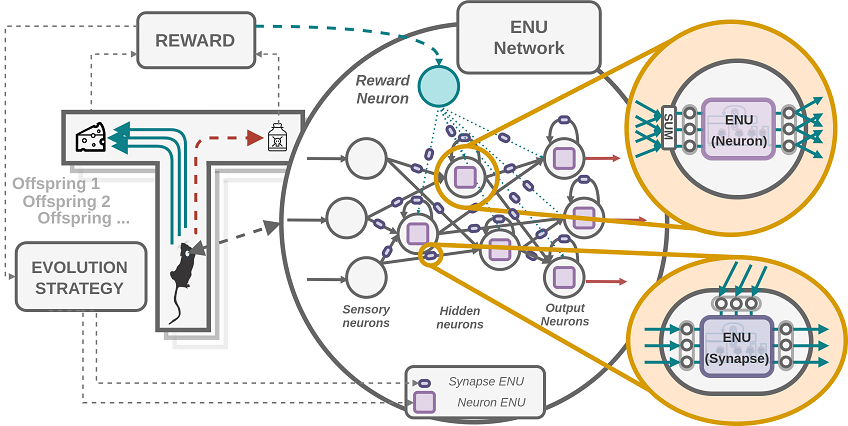
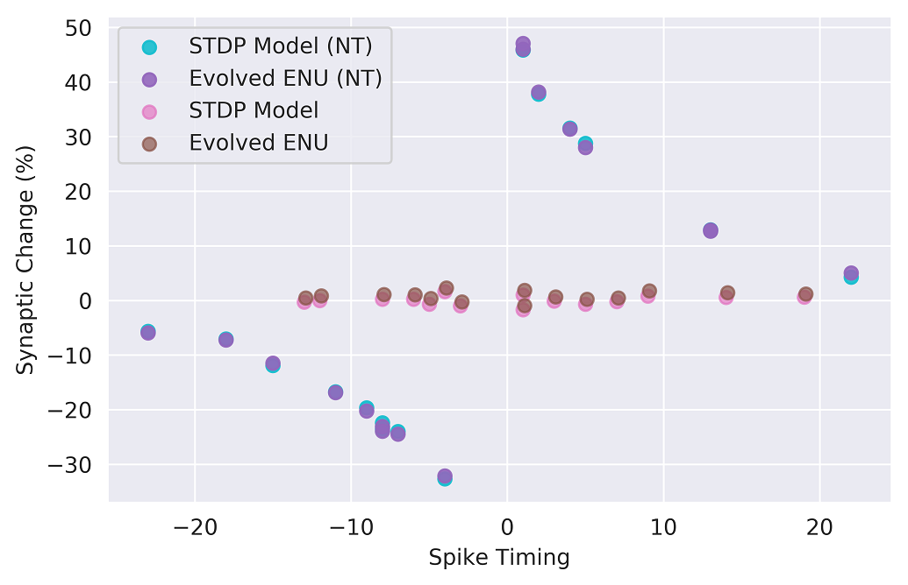
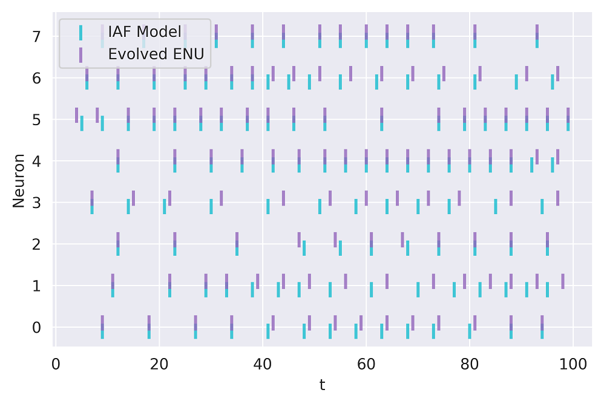
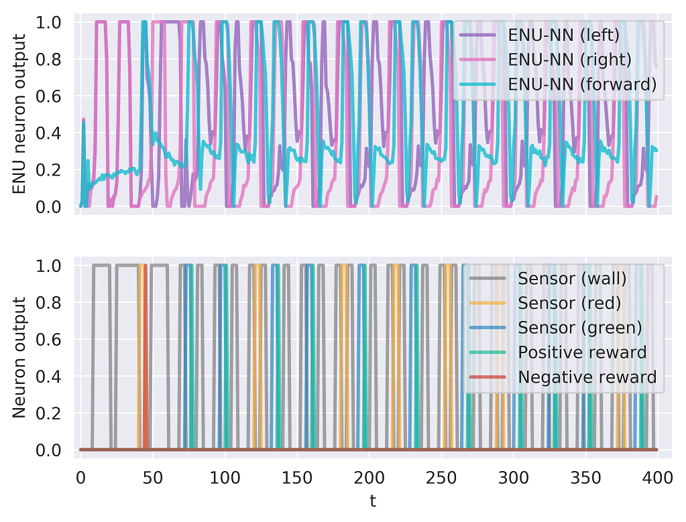
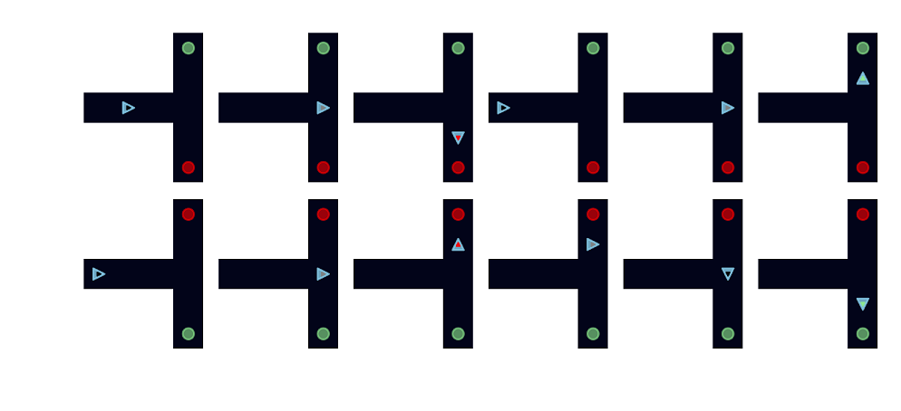

# Network of Evolvable Neural Units Implementation

Original implementation of "Network of Evolvable Neural Units: Evolving to Learn at a Synaptic Level"

#### System Requirements
Software Dependencies
- Ubuntu 18.04
- Python 3.6
- Pytorch 1.3.1
- Numpy 1.17.4
- Cuda 10.1
- Matplotlib
- Seaborn

Hardware requirements 
- Nvidia GPU with at least cuda 10 capability
- \>8 GB ram 
- \>2 CPU cores

#### Installation Guide
The easiest method to get all required packages is through conda https://docs.anaconda.com/anaconda/install/linux/ 

Then 
> conda install pytorch

Install time: ~10min depending on hardware and software environment

#### Demo
Run main entry function in Evolver.py:

> python Evolver.py  

Expected output: 

    total offspring 16384
    SynapseModelSTDP_neuromodulated_enu_singular
    Neuromodulated
    Device: GPU, Backend: Torch  
    Device: GPU, Backend: Torch
    Device: GPU, Backend: Torch
    ------  
    (16384, 1, 38, 64)
    (16384, 1, 38, 32)
    (16384, 1, 33, 1)
    ....
    --Generating Figures--
    --Plotting--
    -----------
    Generation 0  Fitness: -0.24708162 (mean)  0.0004163511 (std)  -0.24558097 (max)  -0.24715616 (base)
    time 4.052653789520264
    --Plotting--
    -----------
    Generation 10  Fitness: -0.099323675 (mean)  0.01998534 (std)  -0.04560723 (max)  -0.09829125 (base)
    time 1.276665210723877
    --Plotting--
    ....

Results are stored in a newly created results folder in the current directory. 
Figures obtained should look similar to the following (after 10000 generations):

NOTE: due to different hardware and software there could be slight differences in results obtained.

Expected run time: ~50min on on a single Nvidia Titan V or Nvidia RTX 2080Ti

#### Instructions for use

Uncomment desired experiment in Evolver.py main function at the bottom 

For example change:

> model_evaluator, evolver = construct_single_exp("SynapseModelSTDP_neuromodulated_enu_singular")

To:

> model_evaluator, evolver = construct_single_exp("NeuronModelIAF_enu_singular", batch_size=32)

and then rerun Evolver.py 

> python Evolver.py 

The final generated figure in the results folder should look similar to:

To reproduce all results can run one of each experiment as follows (one at a time):

> model_evaluator, evolver = construct_single_exp("SynapseModelSTDP_neuromodulated_enu_singular")

> model_evaluator, evolver = construct_single_exp("NeuronModelIAF_enu_singular", batch_size=32)

> model_evaluator, evolver = construct_global_network_exp("RLMazeModelTmaze_enu_network")

Note: For evolving the network of ENUs it can take ~24 hours to converge (on a single Nvidia Titan V or Nvidia RTX 2080Ti).

After fully converging the ENU network on the RL maze environment, one should obtain spiking patterns as follows:

and in the rollout subfolder should obtain every few steps a pattern similar to the following:

Where the agent can be observed to learn to avoid poison and only eat green food that gives positive rewards. 

Note: in the rollout folder it has rollouts for 4 different mutated offspring for every few time steps, the above plot 
was created by taking observations every few time steps of the first offspring. 
Due to random mutation noise some offspring might sometimes perform worse.

### Code Details

File descriptions (in order of importance)
- Evolver.py: entry point, contains the main function that executes the evolutionary process and evolves a singular ENU or Network of ENUs depending on the experiment
- EvolvableNeuralUnitStacked.py: the ENU implementation as in ENU figure of the paper
    - Also contains the LinearLayerBMM class, which implements a feed forward neural network layer with batch matrix multiplication on all offspring in parallel
- EnuGlobalNetwork.py: The Network of ENUs implementation as in Network of ENUs figure and computation figure of the paper
- Optimizers.py: updates the weights of the ENU dependent on fitness of each agent
- ModelEvaluator.py: tracks fitness per time step for each agent and evaluates agent on environment
- MazeTurnEnvVec.py: vectorized T maze implementation in numpy, in order to simulate thousands of agents in parallel efficiently.
- IAFEnv.py: Integrate and Fire model as RL environment
- STDPEnv.py: Spike-Timing-Dependent-Plasticity model as RL environment 
- ExperimentEnvSimple.py: wrapper around env that derives fitness from reward
- ExperimentEnvGlobalNetworkSurvival: wrapper around env that derives fitness from reward
- AbstractLayerBMM.py: abstract interface for all layers and modules 
- Plotter: visualizes and saves figures as result of simulation in ./results folder
- Visualizer: live visualization while running
- Tools: addtional functions deriving path and other general functions like fitness ranking

#### Useful links

http://blog.otoro.net/2017/10/29/visual-evolution-strategies/

https://openai.com/blog/evolution-strategies/ 

https://eng.uber.com/deep-neuroevolution/

https://lilianweng.github.io/lil-log/2019/09/05/evolution-strategies.html